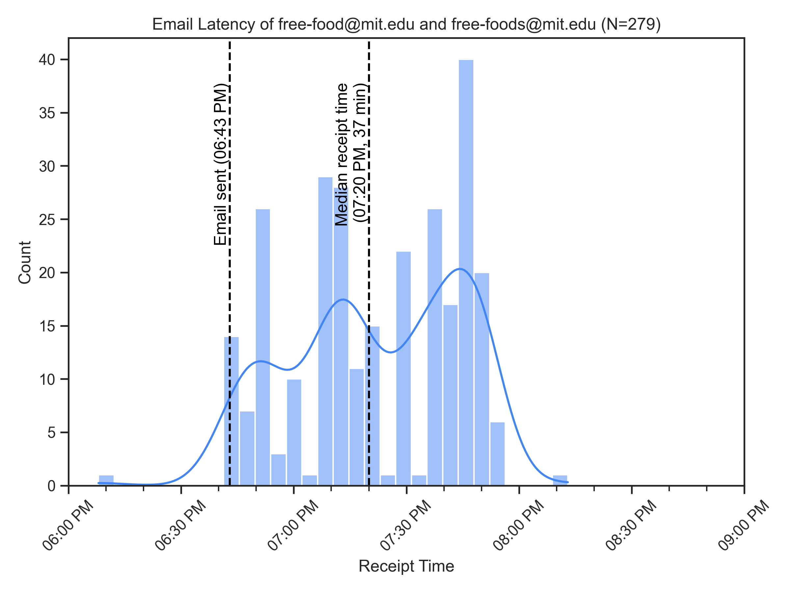

# MIT Free Food Timing

Procrastinating research by plotting data on how long it takes emails on the `free-food at mit edu` mailing list to go through.

Data is thanks to Gabriel R., who sent this email at 6:43 p.m., October 31, 2021 to the MIT free food mailing list along with a survey link:

> apparently food mailing lists can have a surprisingly long delay to send email, so i've decided to make this form to test out the delay. please fill it out to help test out the delay :)
>
> if you're in both free-food and free-foods you'll get this email twice, please fill it out twice for each mailing list
>
> \<link redacted\>

Results:

